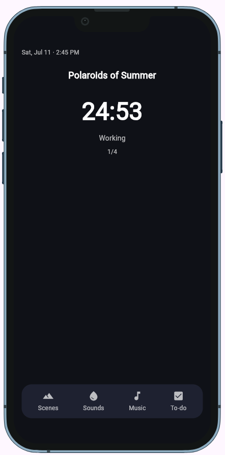
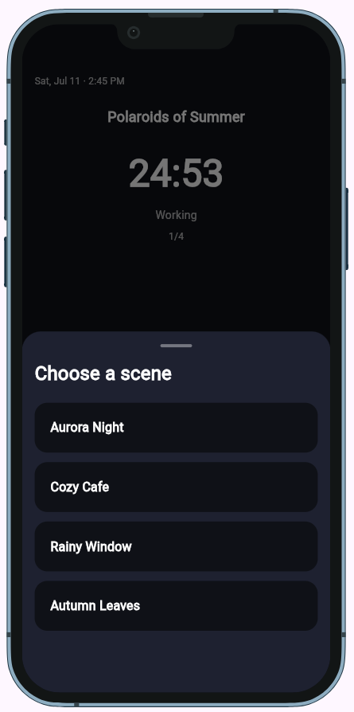
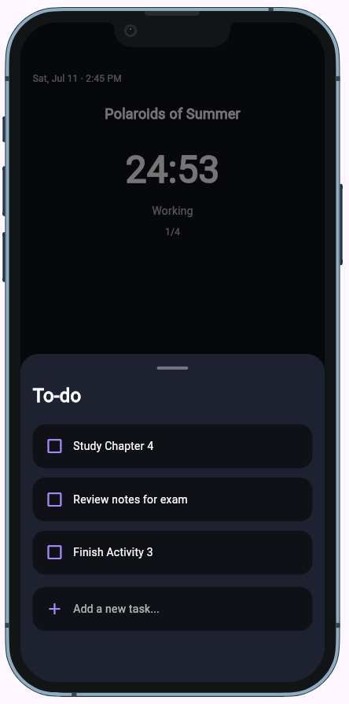

<!--
  This is your project's front page. Replace every placeholder below.
  It is the first thing your instructor and any future employer will read, and
  the live link in it is how your project gets opened for grading.

  New here? Read START-HERE.md first. Delete this comment when you are done.
-->

# Drift
[](AI-USAGE.md)
> Drift is a calming productivity and focus app for users who want to relax, stay focused, and organize their tasks in one place.

**Live demo:** https://YOURUSERNAME.github.io/YOUR-REPO/ <!-- GitHub Pages is set up already; replace if you host elsewhere -->
**Demo video:** `docs/demo.mp4` (link it here once it exists)
**Course:** Applications Development and Emerging Technologies (6ADET), Holy Angel University
**Author:** Miguel Luis M. Alcantara

This repository lives in the author's own GitHub account and is public on
purpose. There is no `student.json` here and there should not be one: see
`docs/06-security-and-privacy.md` for what a public repo means for secrets and
personal data.

---

## Screenshots

Put two or three real screenshots at phone size in `docs/assets/`, then replace
this paragraph with them:

| Home | Scenes | To-do |
| --- | --- | --- |
|  |  |  |

A repo without screenshots reads as abandoned, whatever the code says.

## What it does

Three to five bullets. What can a user actually do?

- Provides a calming home screen designed for focus and productivity.
- Allows users to navigate between scenes, ambient sounds, music, and a to-do list.
- Provides separate screens for choosing and managing the different parts of a focus session.
- Uses a simple, dark visual design intended to create a relaxing atmosphere.

## Built with

| | |
| --- | --- |
| Framework | Flutter (Dart) |
| State | `setState` / provider / riverpod (say which) |
| Storage | shared_preferences |
| Other packages | device_preview — used to preview and test the app across different device sizes and orientations |

## Running it yourself

```bash
flutter pub get
flutter run -d web-server --web-port 8080
```

Then open http://localhost:8080. Requires Flutter 3.44.7

### Environment variables

Drift does not currently require any environment variables or API keys.

If API keys or other secrets are needed in a future feature, they will be stored in a local .env file and will not be committed to the repository.

## Privacy and secrets

Drift is currently designed as a local single-user application and does not send personal data to an external service. Local data persistence is planned to use shared_preferences on the user's device. No real personal information is used in the app's sample data, screenshots, or demo materials.

## Project documentation

| Document | |
| --- | --- |
| [Proposal](docs/01-proposal.md) | the problem, the users, the scope |
| [Mockup and wireframes](docs/02-mockup.md) | what it looks like, and the screen flow |
| [Design system](docs/03-design-system.md) | colors, type, spacing, components |
| [Weekly reports](docs/04-weekly-reports.md) | what happened each week |
| [Demo video](docs/05-demo-video.md) | the recording and what it shows |
| [Start here](START-HERE.md) | how this repo works (delete once you have read it) |
| [Security and privacy](docs/06-security-and-privacy.md) | the checklist, filled in |

## Status and what is next

The main layout and navigation structure of Drift have been implemented, including the Home, Scenes, Sounds, Music, and To-do sections.

The current version focuses on establishing the app's interface and screen structure. The next stages will focus on implementing the functionality behind these screens, including scene selection, sound and music playback, the focus timer, to-do interactions, and local data persistence.

Known areas that still need implementation or testing include audio playback, persistence, and the remaining interactive features.

## Credits

- Packages: see `pubspec.yaml`
- Assets, icons, 3D models, sounds: name the author and the licence for each
- People who helped: None.

## AI use

AI tools were used during development to help with coding assistance, debugging, explanations, and documentation. The final implementation and project decisions were reviewed and adapted as part of the development process.

## Licence

MIT, see [LICENSE](LICENSE).
