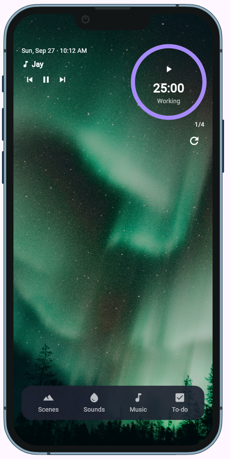
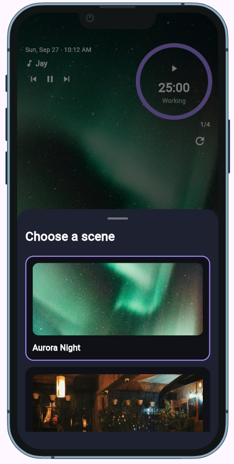
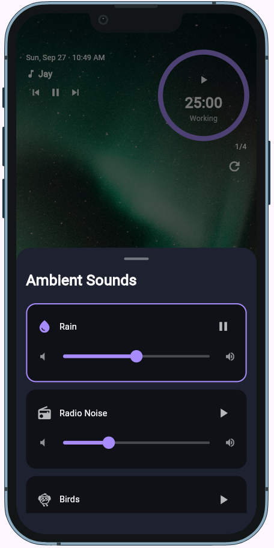
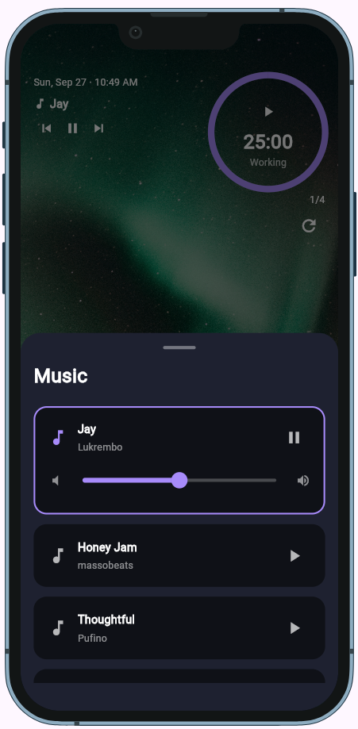
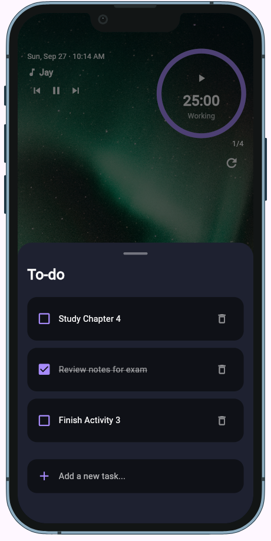

# Drift
[](AI-USAGE.md)
> Drift is a calming productivity and focus app for users who want to relax, stay focused, and organize their tasks in one place.

* **Live demo:** https://migui-alcantara.github.io/Drift/
* **Demo video:** `docs/demo.mp4` (link it here once it exists)
* **Course:** Applications Development and Emerging Technologies (6ADET), Holy Angel University
* **Author:** Migui

---

## Screenshots

| Home | Scenes | Sounds |
| --- | --- | --- |
|  |  |  |

| Music | To-do |
| --- | --- |
|  |  |

## What it does

* Provides a calming home screen with a Pomodoro focus timer, selected scene, current music, and navigation to the main features.
* Allows users to choose scenes and use ambient sounds such as Rain, Radio Noise, Birds, Wind, and Fireplace.
* Allows users to play music with play/pause, previous, next, and volume controls, with the next track starting automatically when a song finishes.
* Allows users to create, complete, and delete to-do tasks.
* Uses a simple, dark visual design intended to create a relaxing atmosphere while working or studying.

## Built with

|                |                                                                                                                                                                |
| -------------- | -------------------------------------------------------------------------------------------------------------------------------------------------------------- |
| Framework      | Flutter (Dart)                                                                                                                                                 |
| State          | `setState`                                                                                                                                                     |
| Storage        | `shared_preferences`                                                                                                                              |
| Other packages | `audioplayers` — used for music and ambient sound playback; `device_preview` — used to preview and test the app across different device sizes and orientations |

## Running it yourself

```bash
flutter pub get
flutter run -d web-server --web-port 8080
```

Then open http://localhost:8080. Requires Flutter 3.44.7

### Environment variables

Drift does not currently require any environment variables or API keys.

If API keys or other secrets are needed in a future feature, they will be stored in a local .env file and will not be committed to the repository.

## Privacy and secrets

Drift is currently designed as a local single-user application and does not send personal data to an external service. The current application state is handled locally while the app is running, and no real personal information is used in the app's sample data, screenshots, or demo materials.

## Project documentation

| Document                                                |                                                    |
| ------------------------------------------------------- | -------------------------------------------------- |
| [Proposal](docs/01-proposal.md)                         | the problem, the users, the scope                  |
| [Mockup and wireframes](docs/02-mockup.md)              | what it looks like, and the screen flow            |
| [Design system](docs/03-design-system.md)               | colors, type, spacing, components                  |
| [Weekly reports](docs/04-weekly-reports.md)             | what happened each week                            |
| [Demo video](docs/05-demo-video.md)                     | the recording and what it shows                    |
| [Start here](START-HERE.md)                             | how this repo works (delete once you have read it) |
| [Security and privacy](docs/06-security-and-privacy.md) | the checklist, filled in                           |

## Status and what is next

The main functionality of Drift has now been implemented, including the Home, Scenes, Sounds, Music, To-do, and Pomodoro timer features.

The current version includes scene selection, ambient sound playback with individual volume controls, music playback with previous and next controls, automatic next-track playback, music volume control, and to-do interactions.

The remaining work focuses on final testing, checking the implementation against the approved mockup, updating the remaining screenshots and documentation, and preparing the final project submission.

## Credits

* Packages: see `pubspec.yaml`
* Assets, icons, 3D models, sounds: assets used in the project were obtained from sources that allow free use; credits and licence information will be included where required
* People who helped: None.

## AI use

AI tools were used during development to help with coding assistance, debugging, explanations, and documentation. The final implementation and project decisions were reviewed and adapted as part of the development process.

## Licence

MIT, see [LICENSE](LICENSE).
