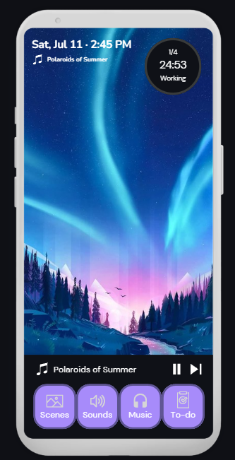
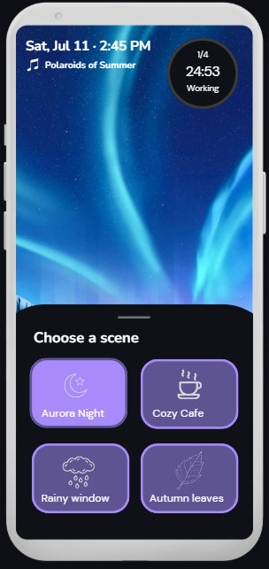
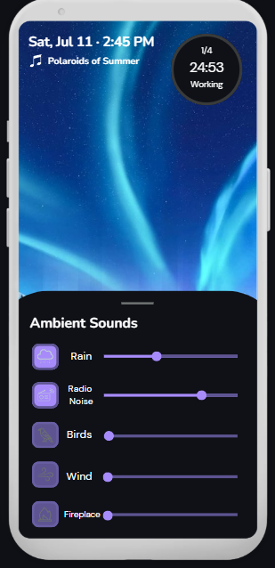
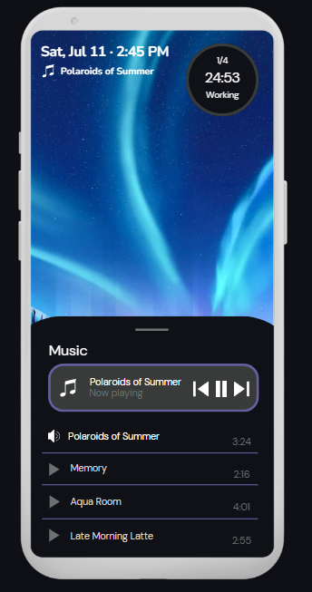
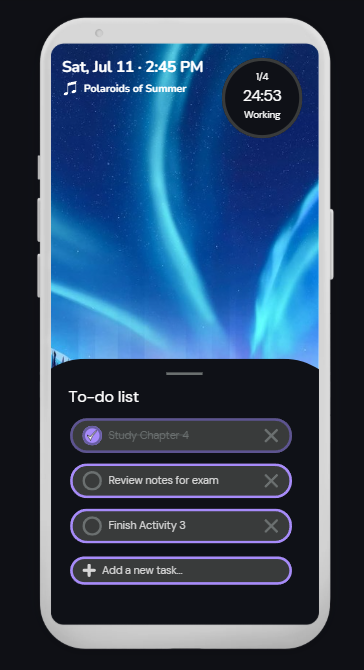

# Mockup and wireframes

The visual plan for Drift. The wireframes show the structure and flow of the app, while the mockup shows the intended visual design.

## Mockup

The Drift mockup shows the main screens and the intended visual appearance of the app.

### Home / Session

The Home screen is the main workspace for a user's focus session. It displays the current date and time, currently playing track, session timer, work status, and session progress. The bottom navigation provides access to Scenes, Sounds, Music, and To-do.

### Scenes

The Scenes panel allows the user to choose a background scene for their focus session. The available scenes are Aurora Night, Cozy Cafe, Rainy Window, and Autumn Leaves.

### Sounds

The Sounds panel contains ambient sound options including Rain, Radio Noise, Birds, Wind, and Fireplace. Each sound has controls for playback and volume.

### Music

The Music panel shows the currently playing track and the available music tracks. It also includes playback controls and track durations.

### To-do

The To-do panel displays the user's tasks and provides an option to add a new task.

## Wireframes

The wireframes show the structure of the Drift interface and the main flow between the different parts of the application.

The user starts at the main session screen and can open the Scenes, Sounds, Music, or To-do panels using the bottom navigation. These panels appear over the Home screen and can be closed by tapping outside the panel or dragging the panel downward.

[View the complete Drift mockup PDF](assets/Wireframe_Drift.pdf)

## Screens

### Welcome Screen

The Welcome screen introduces Drift and contains a **Get Started** button. Selecting the button opens the main Home / Session screen.

### Home / Session Screen

The Home screen is the main workspace. It displays the current session information and provides access to the Scenes, Sounds, Music, and To-do panels through the bottom navigation.

### Scenes Panel

The Scenes panel allows the user to select a background scene. Selecting a scene is intended to change the visual environment of the focus session.

### Sounds Panel

The Sounds panel allows the user to manage ambient sounds such as rain, radio noise, birds, wind, and a fireplace. Users can access playback and volume controls for each sound.

### Music Panel

The Music panel allows the user to view the currently playing track and choose from the available music tracks. Playback controls are provided for controlling the music.

### To-do Panel

The To-do panel displays the user's tasks and provides an option to add new tasks. The to-do list is intended to help users keep track of work they want to complete during their session.
